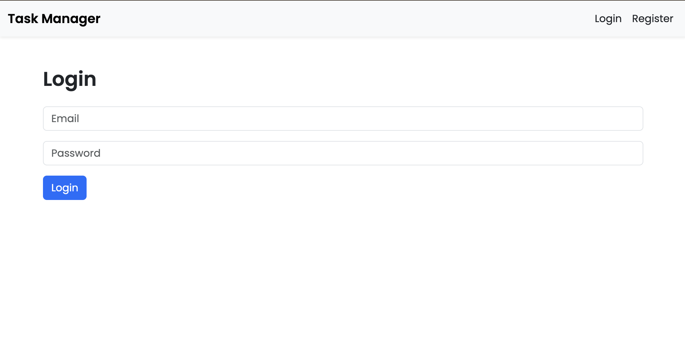
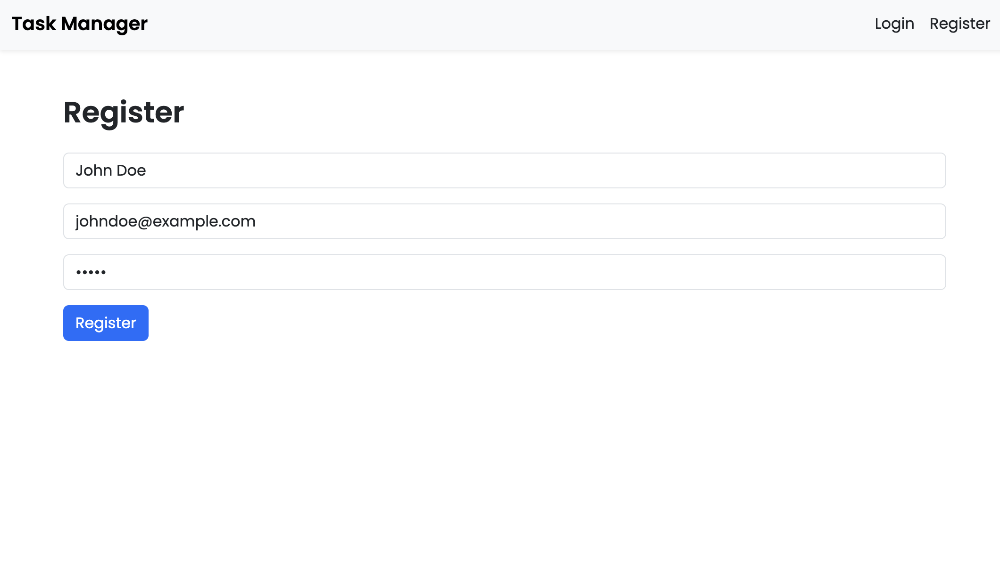
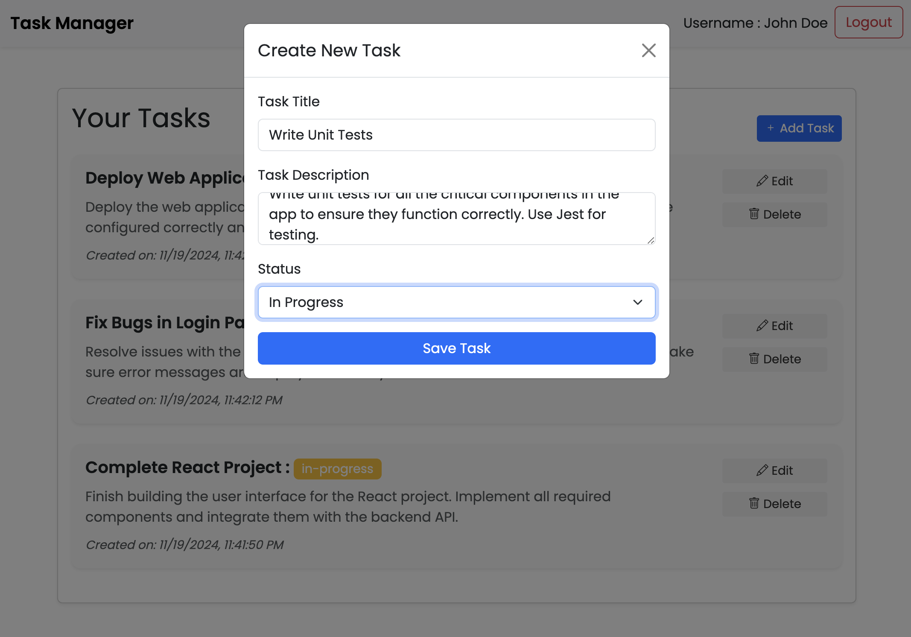
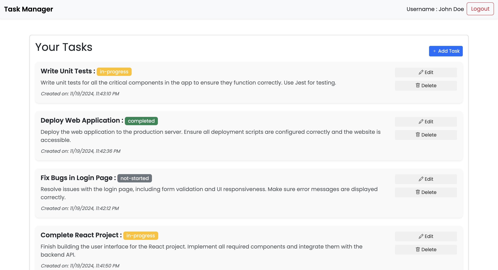
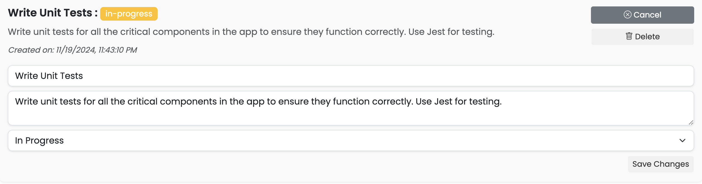

Apologies for the misunderstanding! Below is the **README.md** content, which you can use directly for your project.

---

# Task Management App

A full-stack task management application built with **React** for the frontend, **Express** for the backend, and **PostgreSQL** for database management. This application allows users to manage tasks with features like creating, updating, deleting, and marking tasks as completed. It also uses **JWT (JSON Web Tokens)** for user authentication.

## Features
- **User Authentication**: Users can register and log in using JWT authentication.
- **Task Management**: Users can create, update, delete tasks, and track their progress (Not Started, In Progress, Completed).
- **Responsive UI**: Built using React and styled with Bootstrap.
- **Backend**: Express.js API with JWT for secure authentication and PostgreSQL for database storage.

## Technologies Used
- **Frontend**: React.js, Bootstrap
- **Backend**: Express.js, JWT Authentication
- **Database**: PostgreSQL
- **Styling**: Bootstrap, custom CSS
- **Authentication**: JWT (JSON Web Tokens)

## Project Setup

### Prerequisites
Before getting started, make sure you have the following installed on your machine:
- **Node.js**
- **npm** (Node Package Manager)
- **PostgreSQL**

### Backend Setup

1. **Clone the repository**:
   ```bash
   git clone <your-repository-url>
   cd <your-project-folder>
   ```

2. **Install Backend Dependencies**:
   ```bash
   cd backend
   npm install
   ```

3. **Set up PostgreSQL**:
   - Create a PostgreSQL database.
   - Add your database credentials to the `.env` file in the `backend` directory. Example:
     ```bash
     DATABASE_URL=your_postgres_connection_url
     JWT_SECRET=your_jwt_secret_key
     ```

4. **Start the Backend Server**:
   ```bash
   npm start
   ```
   The backend will be running on `http://localhost:5000`.

### Frontend Setup

1. **Navigate to the frontend folder**:
   ```bash
   cd frontend
   ```

2. **Install Frontend Dependencies**:
   ```bash
   npm install
   ```

3. **Start the React Development Server**:
   ```bash
   npm start
   ```
   The frontend will be running on `http://localhost:3000`.

### Using the Application
1. Open your browser and go to `http://localhost:3000` to access the task management app.
2. Use the login form to authenticate yourself or register a new account.
3. Once logged in, you can view, create, update, and delete tasks.

## Screenshots

### Login Page:
The login page allows users to authenticate with their credentials.


### Register Page:
The register page is where users can create a new account.


### New Task Page:
This page lets users add new tasks with a title, description, and status.


### Task List:
The task list displays all tasks with their status. Tasks can be edited or deleted.


### Task Edit Page:
This page allows users to edit an existing task.


## API Endpoints

### Authentication Routes
- **POST** `/api/auth/register`: Register a new user
  - Request Body: `{ "email": "user@example.com", "password": "password123" }`
- **POST** `/api/auth/login`: Login and obtain a JWT token
  - Request Body: `{ "email": "user@example.com", "password": "password123" }`
  - Response: `{ "token": "jwt_token_here" }`

### Task Routes (Requires JWT Authentication)
- **GET** `/api/tasks`: Get all tasks for the authenticated user.
- **POST** `/api/tasks`: Create a new task.
  - Request Body: `{ "title": "Task Title", "description": "Task description", "status": "not-started" }`
- **PUT** `/api/tasks/:id`: Update an existing task.
  - Request Body: `{ "title": "Updated Title", "description": "Updated description", "status": "in-progress" }`
- **DELETE** `/api/tasks/:id`: Delete a task.

## Troubleshooting

- Ensure that PostgreSQL is running and your database is properly configured.
- If you face CORS issues, ensure the backend allows requests from `http://localhost:3000`.
- If the frontend does not load, ensure the backend API is running first.

## Contributing

If you want to contribute to the project:
- Fork the repository and create a new branch.
- Make your changes and open a pull request.
