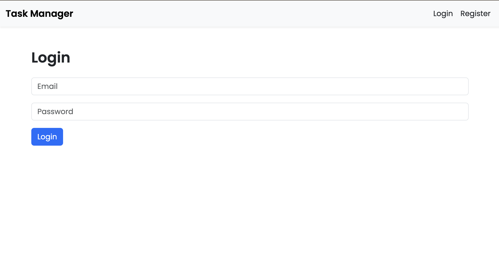
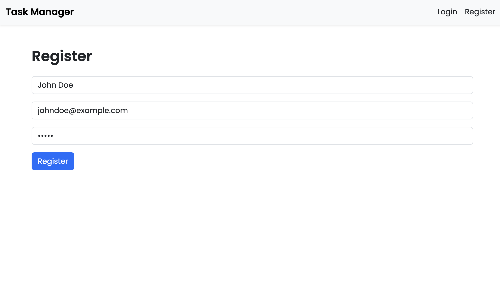
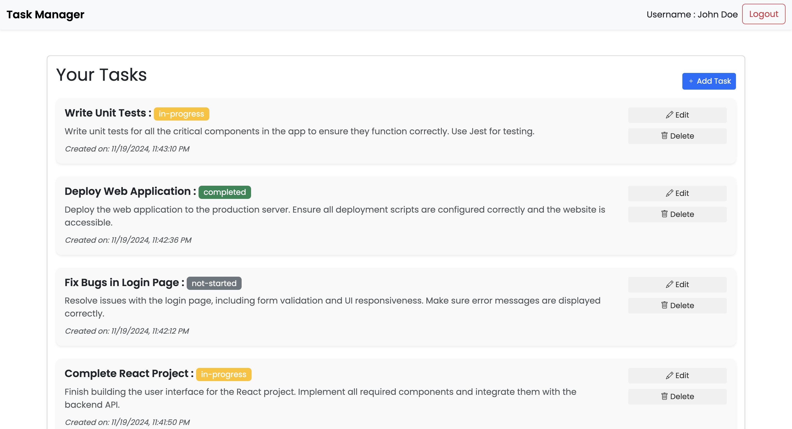
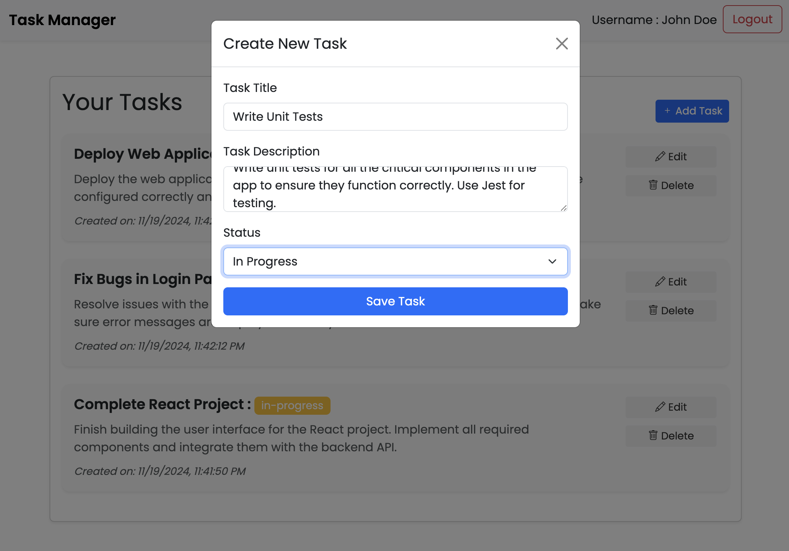
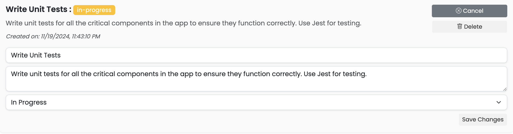

# Task Manager - Full-Stack Application

A modern, feature-rich task management application built with **React 19**, **Express 5**, and **PostgreSQL**. Features include AI-powered task generation, drag-and-drop functionality, Google OAuth, comprehensive profile management, and real-time reminders.

## 🌐 Live Demo
**[https://tejanarra.github.io/Task-Manager](https://tejanarra.github.io/Task-Manager/#/)**

---

## ✨ Features

### 🔐 Authentication & Security
- **JWT Authentication** with secure token management
- **Google OAuth 2.0** integration for quick sign-in
- Email verification system
- Password reset functionality
- Rate limiting protection (5 auth attempts/15 min)
- bcrypt password hashing

### 📋 Task Management
- **Create, Read, Update, Delete (CRUD)** operations
- **Drag-and-drop** task reordering within status columns
- Task status tracking: Not Started, In Progress, Completed
- **Priority system** with automatic reordering
- Rich task descriptions and notes
- Due dates and time tracking
- **Reminders** with multiple notification options:
  - At task time
  - 15 minutes, 30 minutes, 1 hour, 1 day before
  - Custom reminder times
- Task search and filtering
- Pagination support

### 🤖 AI-Powered Features
- **AI Task Generation** using Ollama (deepseek-v3.1)
- Context-aware task suggestions
- Smart task breakdown
- Rate limiting: 20 AI requests/15 min

### 👤 Profile Management
- Complete user profile with avatar upload
- **Modern image cropping** with zoom and rotation (react-easy-crop)
- Cloudinary integration for image hosting
- Bio, phone number, date of birth fields
- Profile photo transformations

### 🎨 User Experience
- **Responsive design** - works on all devices
- **Dark/Light theme toggle** (coming soon)
- Loading states and error handling
- Toast notifications
- Modern Bootstrap 5 UI
- Lucide React icons
- Smooth animations and transitions

---

## 🛠 Technology Stack

### Frontend
| Technology | Version | Purpose |
|------------|---------|---------|
| **React** | 19.2.0 | UI framework |
| **React Router** | 6.30.1 | Client-side routing |
| **Axios** | 1.13.1 | HTTP client |
| **Bootstrap** | 5.3.8 | UI components |
| **@dnd-kit** | 6.3.1+ | Drag-and-drop |
| **react-easy-crop** | 5.5.3 | Image cropping |
| **date-fns** | 4.1.0 | Date formatting |
| **Lucide React** | 0.548.0 | Icons |
| **@react-oauth/google** | 0.12.2 | Google OAuth |

### Backend
| Technology | Version | Purpose |
|------------|---------|---------|
| **Express** | 5.1.0 | Web framework |
| **Sequelize** | 6.37.7 | ORM |
| **PostgreSQL** | 8.16.3 | Database |
| **JWT** | 9.0.2 | Authentication |
| **bcryptjs** | 3.0.2 | Password hashing |
| **Cloudinary** | 2.8.0 | Image hosting |
| **Nodemailer** | 7.0.7 | Email service |
| **Ollama** | 0.6.0 | AI integration |
| **node-cron** | 4.2.1 | Scheduled tasks |
| **express-rate-limit** | 8.2.0 | Rate limiting |

### Testing
| Technology | Version | Purpose |
|------------|---------|---------|
| **Jest** | 30.2.0 | Test framework |
| **React Testing Library** | 16.3.0 | Component testing |
| **Supertest** | 7.1.4 | API testing |

---

## 📦 Installation & Setup

### Prerequisites
- **Node.js** 16+ (ES6 modules required)
- **PostgreSQL** 12+
- **npm** or **yarn**
- **Ollama** (optional, for AI features)

### Backend Setup

1. **Clone the repository**
   ```bash
   git clone https://github.com/tejanarra/Task-Manager.git
   cd Task-Manager/Backend
   ```

2. **Install dependencies**
   ```bash
   npm install
   ```

3. **Environment Configuration**

   Create a `.env` file in the `Backend` directory:
   ```env
   # Server
   PORT=5001
   NODE_ENV=development

   # Database
   DB_HOST=localhost
   DB_PORT=5432
   DB_NAME=taskmanager
   DB_USER=your_db_user
   DB_PASSWORD=your_db_password

   # JWT
   JWT_SECRET=your_super_secret_jwt_key_min_32_chars
   JWT_EXPIRATION=7d

   # Email (Gmail example)
   EMAIL_USER=your_email@gmail.com
   EMAIL_PASS=your_app_specific_password
   EMAIL_FROM=Task Manager <noreply@taskmanager.com>

   # Google OAuth
   GOOGLE_CLIENT_ID=your_google_client_id.apps.googleusercontent.com

   # Cloudinary
   CLOUDINARY_CLOUD_NAME=your_cloud_name
   CLOUDINARY_API_KEY=your_api_key
   CLOUDINARY_API_SECRET=your_api_secret

   # Ollama (optional)
   OLLAMA_HOST=http://localhost:11434
   OLLAMA_MODEL=deepseek-v3.1

   # Frontend URL
   FRONTEND_URL=http://localhost:3000
   ```

4. **Database Setup**
   ```bash
   # Create PostgreSQL database
   createdb taskmanager

   # Tables will be created automatically by Sequelize on first run
   ```

5. **Start the server**
   ```bash
   npm start          # Production mode
   npm run dev        # Development mode
   npm test           # Run tests
   npm run test:coverage  # Test coverage
   ```

   Backend runs on `http://localhost:5001`

### Frontend Setup

1. **Navigate to frontend**
   ```bash
   cd ../Frontend
   ```

2. **Install dependencies**
   ```bash
   npm install --legacy-peer-deps
   ```

3. **Environment Configuration**

   Create `.env` file in the `Frontend` directory:
   ```env
   REACT_APP_API_URL=http://localhost:5001/api
   REACT_APP_GOOGLE_CLIENT_ID=your_google_client_id.apps.googleusercontent.com
   ```

4. **Start development server**
   ```bash
   npm start          # Development mode
   npm run build      # Production build
   npm test           # Run tests
   ```

   Frontend runs on `http://localhost:3000`

---

## 🚀 Usage

1. **Register/Login**
   - Create an account with email/password
   - Or use Google OAuth for quick sign-in
   - Verify email if required

2. **Manage Tasks**
   - Create new tasks with title, description, status
   - Set due dates and reminders
   - Drag-and-drop to reorder priorities
   - Edit or delete existing tasks
   - Track task progress

3. **AI Task Generation**
   - Use AI assistant to generate task suggestions
   - Get smart task breakdowns
   - Context-aware recommendations

4. **Profile Management**
   - Upload and crop profile photo
   - Update personal information
   - Manage account settings

---

## 📸 Screenshots

### Login & Registration

*Secure authentication with email or Google OAuth*


*Quick and easy registration process*

### Task Management

*Comprehensive task view with drag-and-drop functionality*


*Create tasks with detailed information and reminders*


*Full-featured task editing with status tracking*

---

## 🔌 API Documentation

### Base URL
```
http://localhost:5001/api
```

### Authentication Required
All endpoints except `/auth/register`, `/auth/login`, and `/auth/google` require JWT token in header:
```
Authorization: Bearer <your_jwt_token>
```

### Endpoints

#### 🔐 Authentication (`/auth`)
| Method | Endpoint | Description |
|--------|----------|-------------|
| POST | `/register` | Register new user |
| POST | `/login` | Login with email/password |
| POST | `/google` | Login with Google OAuth |
| POST | `/verify-email` | Verify email address |
| POST | `/forgot-password` | Request password reset |
| POST | `/reset-password` | Reset password with token |
| POST | `/logout` | Logout user |

#### 📋 Tasks (`/tasks`)
| Method | Endpoint | Description |
|--------|----------|-------------|
| GET | `/` | Get all tasks (paginated) |
| GET | `/:id` | Get single task |
| POST | `/` | Create new task |
| PUT | `/:id` | Update task |
| DELETE | `/:id` | Delete task |
| PATCH | `/:id/priority` | Update task priority |

#### 👤 Profile (`/profile`)
| Method | Endpoint | Description |
|--------|----------|-------------|
| GET | `/` | Get user profile |
| PUT | `/` | Update profile (with avatar) |
| DELETE | `/avatar` | Delete profile avatar |

#### 🤖 AI (`/ai`)
| Method | Endpoint | Description |
|--------|----------|-------------|
| POST | `/generate-task` | Generate task suggestions |
| POST | `/chat` | Chat with AI assistant |

---

## 🧪 Testing

### Backend Tests (116 tests)
```bash
cd Backend
npm test                  # Run all tests
npm run test:watch       # Watch mode
npm run test:coverage    # Coverage report
```

**Test Suites:**
- Authentication Middleware
- Password Utilities
- Token Utilities
- Validation Utilities
- Task Controller
- Profile Controller
- AI Controller

### Frontend Tests
```bash
cd Frontend
npm test                  # Run tests
```

---

## 📁 Project Structure

```
Task-Manager/
├── Backend/
│   ├── __tests__/           # Test files
│   ├── config/              # Configuration (DB, constants)
│   ├── controllers/         # Request handlers
│   ├── middleware/          # Auth, validation, rate limiting
│   ├── models/              # Sequelize models
│   ├── routes/              # API routes
│   ├── utils/               # Helper functions
│   ├── services/            # Business logic
│   └── server.js            # Entry point
│
├── Frontend/
│   ├── public/              # Static files
│   └── src/
│       ├── components/      # React components
│       │   ├── auth/        # Login, Register
│       │   ├── tasks/       # Task management
│       │   ├── profile/     # User profile
│       │   ├── common/      # Shared components
│       │   └── layout/      # Layout components
│       ├── context/         # React Context (Auth)
│       ├── hooks/           # Custom hooks
│       ├── services/        # API calls
│       ├── constants/       # App constants
│       └── utils/           # Helper functions
│
├── Assets/                  # Images and assets
├── CLAUDE.md               # Developer documentation
├── GIT_REFERENCE.md        # Git guide
└── README.md               # This file
```

---

## 🔒 Security Features

- **JWT Authentication** with secure token storage
- **Password Hashing** using bcrypt
- **Rate Limiting** on sensitive endpoints
- **Input Validation** on all requests
- **SQL Injection Protection** via Sequelize ORM
- **CORS Configuration** for frontend-backend communication
- **Environment Variables** for sensitive data
- **File Upload Validation** (size, type)

---

## 🐛 Troubleshooting

### Database Connection Issues
```bash
# Verify PostgreSQL is running
pg_isready

# Check connection string in .env
# Ensure database exists
psql -l | grep taskmanager
```

### Port Already in Use
```bash
# Backend (5001)
lsof -ti:5001 | xargs kill -9

# Frontend (3000)
lsof -ti:3000 | xargs kill -9
```

### Module Not Found Errors
```bash
# Clean install
rm -rf node_modules package-lock.json
npm install --legacy-peer-deps
```

### Ollama AI Not Working
```bash
# Install Ollama
# Visit: https://ollama.com

# Pull model
ollama pull deepseek-v3.1

# Verify it's running
curl http://localhost:11434/api/tags
```

---

## 📚 Additional Documentation

- **[CLAUDE.md](./CLAUDE.md)** - Detailed developer guide for code architecture
- **[GIT_REFERENCE.md](./GIT_REFERENCE.md)** - Git workflows and commands

---

## 🤝 Contributing

1. Fork the repository
2. Create a feature branch: `git checkout -b feature/amazing-feature`
3. Commit changes: `git commit -m 'Add amazing feature'`
4. Push to branch: `git push origin feature/amazing-feature`
5. Open a Pull Request

### Coding Standards
- Follow ES6+ JavaScript syntax
- Use meaningful variable names
- Add comments for complex logic
- Write tests for new features
- Update documentation

---

## 📝 License

This project is licensed under the ISC License.

---

## 👨‍💻 Author

**Teja Narra**
- Email: snarra@hawk.iit.edu
- GitHub: [@tejanarra](https://github.com/tejanarra)

---

## 🙏 Acknowledgments

- React team for React 19
- Express team for Express 5
- Sequelize for excellent ORM
- Ollama for AI capabilities
- Cloudinary for image hosting
- All open-source contributors

---

## 📈 Changelog

### Latest Updates (2025-10-30)
- ⬆️ Upgraded to React 19.2.0
- ⬆️ Upgraded to React Router 6.30.1 (latest stable for CRA)
- ⬆️ Upgraded to Express 5.1.0
- ✨ Replaced react-avatar-editor with react-easy-crop
- 📦 Updated all dependencies to latest versions
- 🔒 Enhanced security with latest bcrypt 3.0.2
- 📝 Comprehensive documentation updates

### Previous Updates
- 🎨 Added drag-and-drop functionality
- 🤖 Integrated AI task generation
- 🔐 Added Google OAuth support
- 📧 Implemented email verification
- ⏰ Added reminder system
- 🧪 Comprehensive testing suite (116 backend tests)

---

**Made with ❤️ using React 19, Express 5, and PostgreSQL**
